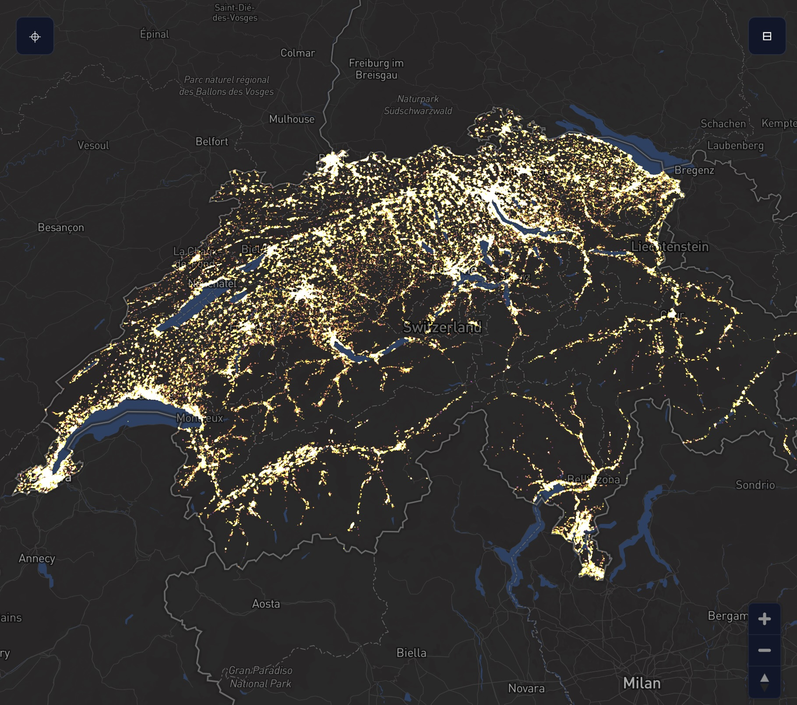
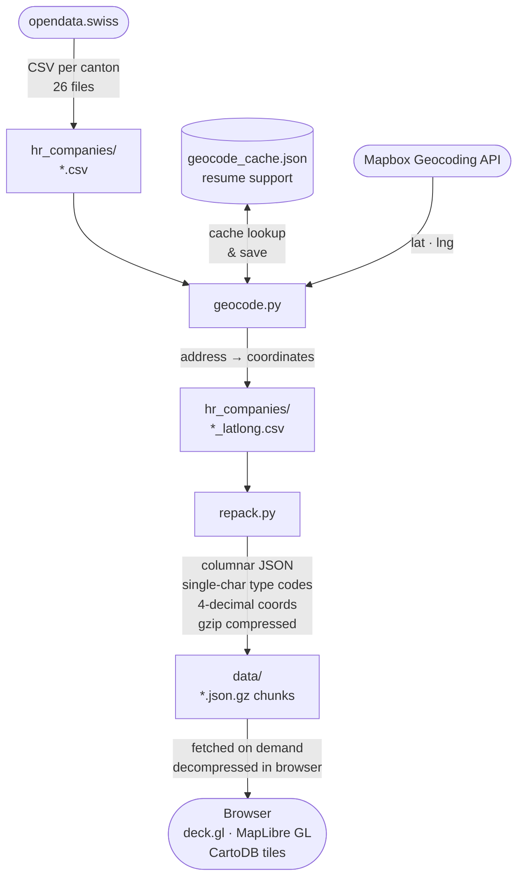

# SwissViz

An interactive map of every registered company in Switzerland — all 750,000+ of them.

---

  

---

## What is this?

SwissViz turns Switzerland's official public business registry into a visual map you can explore. Each dot on the map is a real, registered company. The colour tells you what kind of company it is — corporations in yellow, foundations in purple, sole traders in orange, and so on.

**Live at → [rafapolo.github.io/swissviz](https://rafapolo.github.io/swissviz)**

No account needed. No install. Just open the link.

---

## How to use it

### Navigating the map
- **Scroll** (or pinch on mobile) to zoom in and out
- **Click and drag** to move around
- **Click any dot** to see the company name and legal form

### Searching for a company
Type any company name in the **search bar** at the top of the map. Results appear instantly and search across all 760,000+ companies — even ones in cantons you haven't loaded yet.

- Use **↑ / ↓ arrow keys** to move through results, **Enter** to select
- Click any result to fly directly to that company on the map — a transparent green ring marker appears on the exact dot for 3 seconds so you can spot it without covering it
- If a company name matches multiple locations (e.g. a chain with branches), all locations are marked simultaneously and the map fits to show them all
- If the company's canton wasn't loaded yet, it loads automatically

### Left panel — Cantons
Choose which cantons (regions) to show on the map. By default Bern is loaded. Click any canton name to load its companies. You can select all or none with the buttons at the top.

### Right panel — Legend
The legend shows the 12 legal forms and their colours. Click any item to hide or show that company type. The number in brackets shows how many companies of that type are visible.

Switch between **DE** (German labels) and **EN** (English labels) using the buttons in the top-right of the legend.

### Night view
At the bottom of the legend panel there's a **Night view** toggle. It turns all dots the same warm amber colour, making the density of business activity stand out against the dark map — great for seeing which areas are most commercially active.

### Collapsing the panels
On desktop, click the **‹** or **›** arrow inside each panel header to slide it out of the way. Click the icon button that appears in the corner to bring it back.

On mobile, tap the corner icons to open panels as bottom sheets. Tap anywhere on the map to close them.

---

## Where does the data come from?

All data is sourced from **[opendata.swiss](https://opendata.swiss)** — Switzerland's official open government data portal. The business registry is public information, updated regularly by the Swiss federal authorities.

The map tiles (the street map underneath) come from [CartoDB](https://carto.com/) using [OpenStreetMap](https://www.openstreetmap.org/) data. Both are free and open.

**No data is collected from visitors.** There is no tracking, no cookies, no login.

---

## Technical notes

For those curious about how it works under the hood:

- Company data is downloaded from opendata.swiss (one CSV file per canton, 26 total)
- Addresses are geocoded (converted to map coordinates) using the Mapbox Geocoding API
- The coordinates are compressed and stored as gzipped JSON files, one per canton, fetched on demand — no server needed
- Parsing runs in a **web worker** so the UI stays responsive while large cantons load
- A separate **global search index** (`search_index.json.gz`, ~8 MB compressed) enables instant name search across all 760k companies without loading every canton — the index is pre-lowercased at build time for zero-cost case-insensitive matching
- A **service worker** caches data files after the first visit so the map loads fast on repeat visits; cantonal data is also preloaded in the background after initial render
- CDN scripts are deferred and canton data is preloaded so the map is interactive as fast as possible
- The map renders entirely in your browser using [deck.gl](https://deck.gl) and [MapLibre GL](https://maplibre.org/)
- Keyboard navigation, ARIA labels, and color contrast meet WCAG AA accessibility standards
- The whole thing is a single HTML file + data files, hosted for free on GitHub Pages

### Data pipeline

---

Built by [ExtraPolo.com](https://extrapolo.com) · Data: [opendata.swiss](https://opendata.swiss) · Map: [CartoDB](https://carto.com/) / [OpenStreetMap](https://www.openstreetmap.org/)
